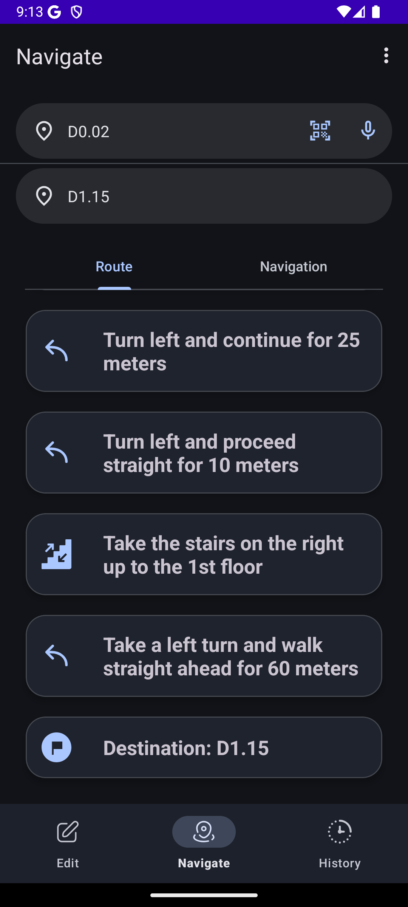
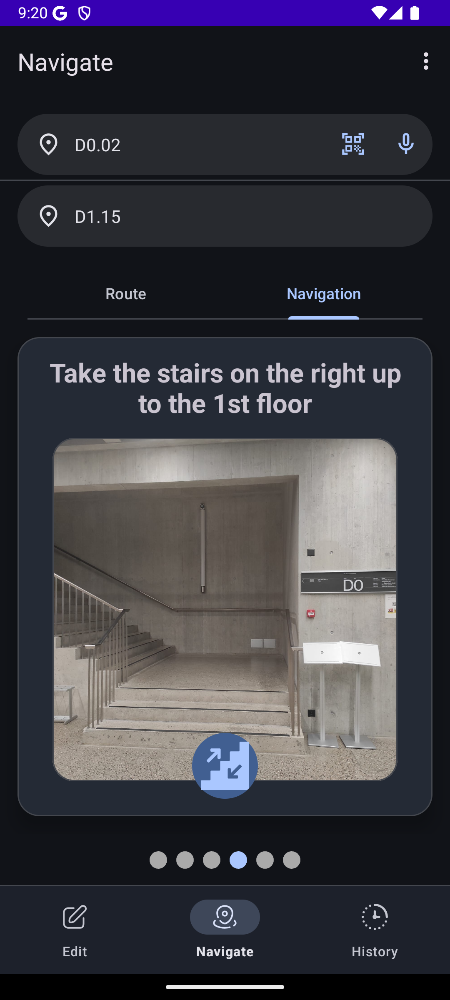
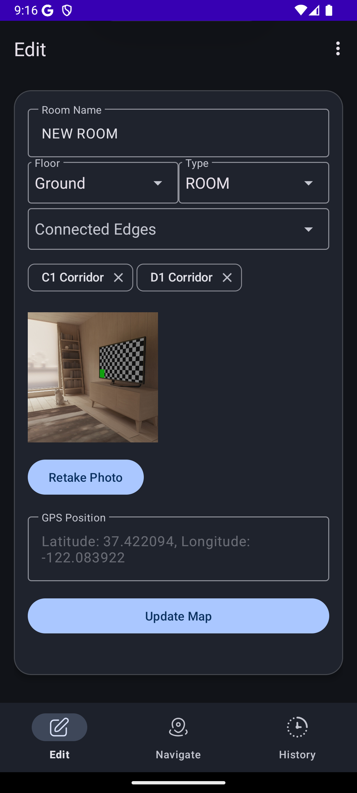
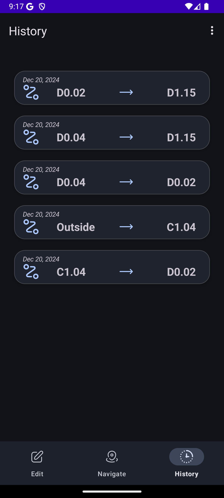

# MWC-project

This repository contains the project for the [Mobile and Wearable Computing](https://search.usi.ch/courses/35270597/mobile-and-wearable-computing) course at USI (Università della Svizzera Italiana).

## The Team

|                                                                                      |                                                               |
| ------------------------------------------------------------------------------------ | ------------------------------------------------------------- |
|  | [Alessandro Gobbetti](https://github.com/Alessandro-Gobbetti) |
|  | [Diell Kryeziu](https://github.com/Diellk)                    |

## Project Description

USIMaps is a mobile Android application that allows users to navigate the campus of the Università della Svizzera Italiana (USI) in Lugano.

## Prerequisites

Android Studio (latest version)

Minimum SDK: 26

Recommended Device: Android 8.0 (Oreo) or higher

## Permissions

This app requires the following permissions:

1. Camera: For scanning QR codes and capturing room images.
2. Location: For determining GPS coordinates of locations.
3. Microphone: For voice-based input.

## How to run the project

1. Clone the repository
2. Open the project in Android Studio
3. Run the project on an emulator or a physical device

## Features

### Navigation and Location Search

Users can search for locations using a search bar.

Instructions are provided step-by-step with navigation cards.

### QR Code Scanning

Scans QR codes to fetch location information.

Validates QR codes against pre-defined valid locations.

### Camera and Image Capture

Capture photos with GPS coordinates and direction.

Save images and metadata to local storage and database.

### Map Extension

Allows for the extension the map by adding new connections with fields such as:

1. Room name

2. Floor

3. Connected edges

Room type

Supports photo selection or capturing.

### Speech-to-Text and Text-to-Speech Integration

Users can input their current location and destination via voice commands.

Instructions are read aloud using Text-to-Speech.

### Offline Support

Stores map data locally for offline usage.

## Technologies Used

### Android CameraX

### Google ML Kit

### SQLite

### Material Design

### Text-to-Speech and Speech-to-Text

### Google Gemini API
